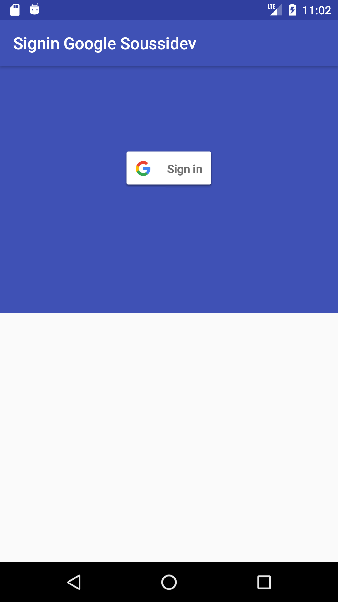

# SigninGoogleSoussidev
Simple Signin with RxActivityResult
<br>
<a href='https://ko-fi.com/A243447K' target='_blank'></a><br>

# Add dependencie to your project :

```gradle
dependencies {
    compile 'com.github.datalink747:Rx_java2_soussidev:1.3'
}
```

# Preview :

* Disconnect :</br>


* Connect :</br>

<br>

# Code in Java:

```java
* Function onRxActivityResult

 //function onRxActivityResult
    private void getResultActivity()
    {

        RxActivityResultCompact.startActivityForResult(this, signInIntent, RC_SIGN_IN)
                .subscribe(new Consumer<ActivityResult>() {
                    @Override
                    public void accept(@NonNull ActivityResult result) throws Exception {
                        if (result.isOk()) {

                            GoogleSignInResult res = Auth.GoogleSignInApi.getSignInResultFromIntent(result.getData());
                            handleSignInResult(res);
                        }
                    }
                });
    }

```
* setResult()
```java
 setResult(RC_SIGN_IN , signInIntent);
```

# Linkedin

<a href="https://www.linkedin.com/in/soussimohamed/">

</a>

# Licence

```
Copyright 2017 Soussidev, Inc.

Licensed under the Apache License, Version 2.0 (the "License");
you may not use this file except in compliance with the License.
You may obtain a copy of the License at

   http://www.apache.org/licenses/LICENSE-2.0

Unless required by applicable law or agreed to in writing, software
distributed under the License is distributed on an "AS IS" BASIS,
WITHOUT WARRANTIES OR CONDITIONS OF ANY KIND, either express or implied.
See the License for the specific language governing permissions and
limitations under the License.
```
